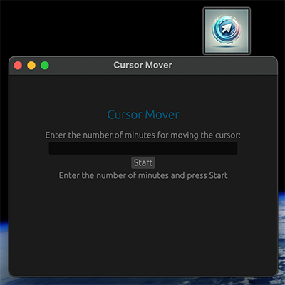
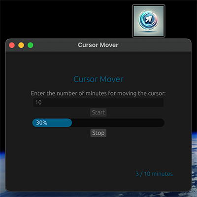
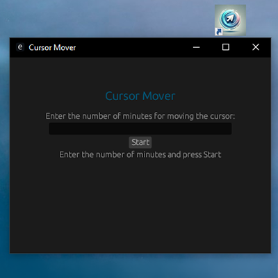
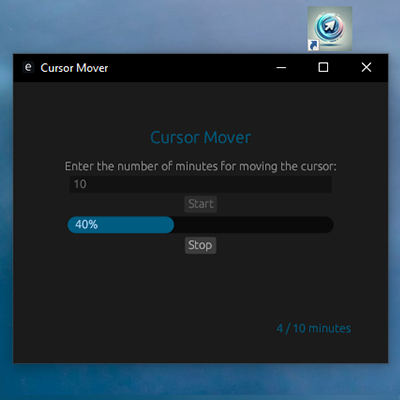

# GUI Cursor Mover

Cursor Mover is a simple GUI application designed to periodically move the cursor on your screen. It is particularly useful for preventing your computer from going idle.

## Features

- Set the duration in minutes for the cursor movement.
- Displays a progress bar to indicate time elapsed.
- Option to stop the cursor movement at any time.
- Simple and intuitive GUI.
- Cross-platform support for macOS and Windows.

## Example Screen (macOS)

<p align="center">
  
  
</p>

## Example Screens (Windows)

<p align="center">
  
  
</p>

## Getting Started

### Prerequisites

- [Rust](https://www.rust-lang.org/) installed on your machine.

### Building the Application

#### macOS

1. Clone the repository:
   ```bash
   git clone https://github.com/dimitripavlov/gui-cursor-mover.git
   ```
2. Build and run:
   ```bash
   cargo build --release
   cargo run
   ```
3. To create a `.app` bundle:
    - Install `cargo-bundle`:
      ```bash
      cargo install cargo-bundle
      ```
    - Build the app:
      ```bash
      cargo bundle
      ```
    - Find the `.app` file in `target/release/bundle/macos`.

#### Windows

1. Clone the repository:
   ```bash
   git clone https://github.com/your-repo/cursor-mover.git
   cd cursor-mover
   ```
2. Build and run:
   ```bash
   cargo build --release
   cargo run
   ```
3. To add an icon:
    - Create a file `build.rs` with the following content:
      ```rust
      fn main() {
          if cfg!(target_os = "windows") {
              let mut res = winres::WindowsResource::new();
              res.set_icon("icon.ico"); // Replace with the path to your .ico file
              res.compile().unwrap();
          }
      }
      ```
    - Add the `winres` crate:
      ```bash
      cargo add winres
      ```
    - Rebuild the project:
      ```bash
      cargo build --release
      ```

## Usage

1. Launch the application.
2. Enter the number of minutes for cursor movement.
3. Click "Start" to begin.
4. The cursor will move periodically based on the set duration.
5. Click "Stop" to end the cursor movement.

## License

This project is licensed under the MIT License.

